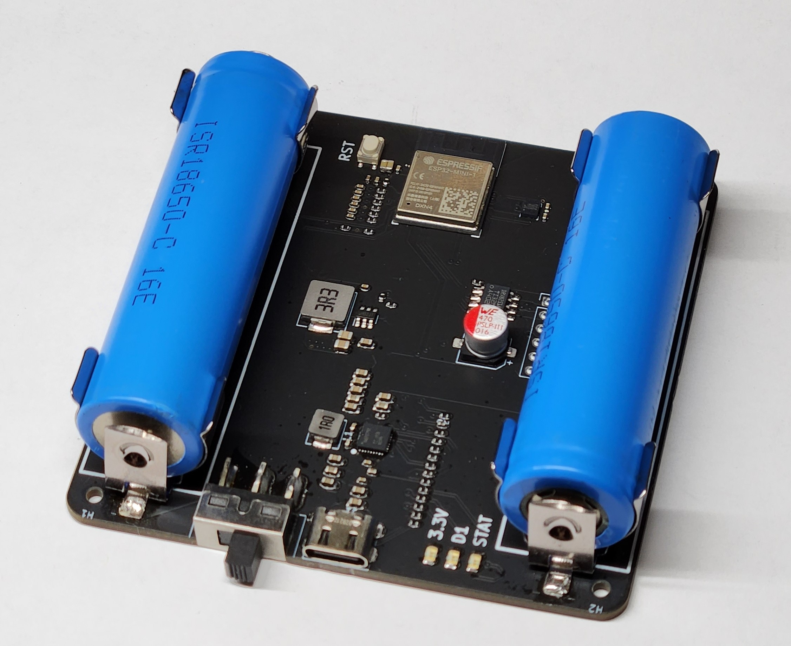

# AutoTiller
An autopilot for my 1977 AMF Sunfish

## Usage ## 
- The AutoTiller attaches to the tiller handle with clips going to each side of the boat.

| Keypress | Action             |
|----------|--------------------|
|  Set     |  sets heading |
|+15|heading+=15|
|-15|heading-=15|
|+1|heaing++|
|-1|heading--|
|Fn & Set| Calibrates compass, rotate device around for 30 seconds|
|Fn & +1| deadspace++|
|Fn & +15| torquePID.P++|
|Fn & -1| deadspace--|
|Fn & -15| torquePID.P-- |

## Schematic

The schematic for the PCB can be found in the `media` directory:

## PCB Layout

The PCB layout file can also be found in the `media` directory:

 

## PCB Top Layer

The view of the board from the cockpit:

 
