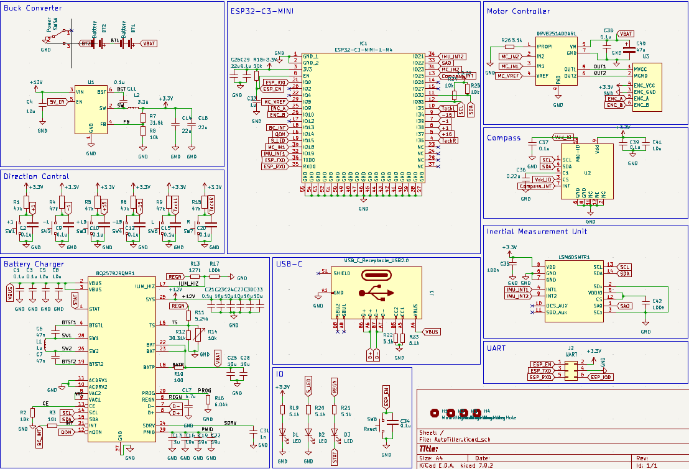

# AutoTiller
A simple autopilot for my 1977 AMF Sunfish

## Schematic

The schematic for the PCB can be found in the `media` directory:

## PCB Layout

The PCB layout file can also be found in the `media` directory:

 

## PCB Top Layer

The view of the board from the cockpit:

 
